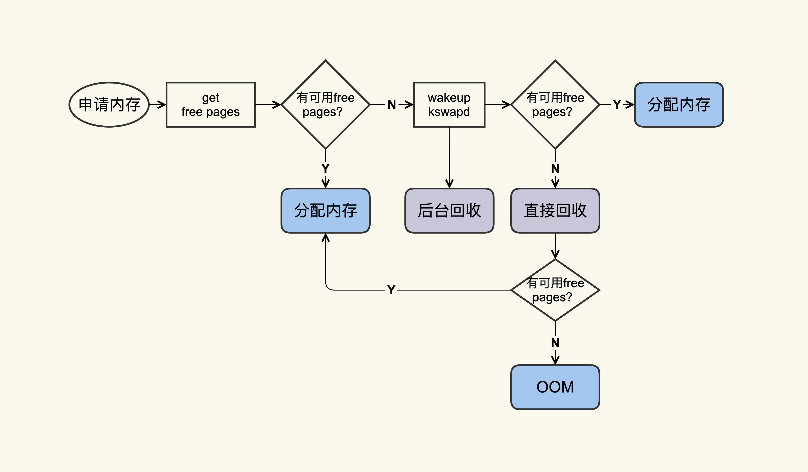

# CPU

# 内存

## page cache


- page cache 属于内核内存，不属于用户态
- 标准 I/O 和内存映射 I/O 会使用 page cache，减少 I/O 读写次数，而直接 I/O 直接操作磁盘


### 如何查看 page cache

可以使用 `/proc/meminfo` 或者 `free -k` 

```sh
$ cat /proc/meminfo
...
Buffers:            1224 kB
Cached:           111472 kB
SwapCached:        36364 kB
Active:          6224232 kB
Inactive:         979432 kB
Active(anon):    6173036 kB
Inactive(anon):   927932 kB
Active(file):      51196 kB
Inactive(file):    51500 kB
...
Shmem:             10000 kB
...
SReclaimable:      43532 kB
...
```

> page cache = Buffers + Cached + SwapCached = Active(file) + Inactive(file) + Shmem + SwapCached

- Buffers + Cached：可以看做是同一类，缓冲区或缓存
- Active(file)+Inactive(file)：属于 File-backed page（与文件对应的内存页），平时使用 mmap() 内存映射和 buffered I/O 消耗的内存就属于这部分
- **SwapCached** ：打开 Swap 分区后，把 Inactive(anon)+Active(anon) 这两项的匿名页交换到磁盘(swap out)，然后再读入到内存(swap in)后分配的内存，由于读入到内存后原来的 swap file 还在，所以 SwapCached 也可以认为是 File-backed page，即属于 page cache
- Shmem 是指匿名共享映射这种方式分配的内存(free 命令中 shared 一项)，即共享内存。比如 tmpfs（临时文件系统），不易产生问题


```sh
$ free -k
              total        used        free      shared  buff/cache   available
Mem:        7926580     7277960      492392       10000      156228      430680
Swap:       8224764      380748     7844016
```

其中，

> buff/cache = Buffers + Cached + SReclaimable

- buff/cache：强调的是内存的可回收性，也就是可以被回收的内存统计在这一项
- SReclaimable：可被回收的内核内存，包括 dentry 和 inode 等


## Swap 分区

https://blog.csdn.net/zqz_zqz/article/details/80333607


## page cache 的好处

**好处：**

内存的速度是比磁盘快很多的，page cache 可以减少磁盘 I/O 访问的次数，提升应用的 I/O 速度。

**不足：**

对应用程序太过透明，以至于应用很难有好办法来控制它。


**如果不用 page cache，也有两种思路来解决：**

- 应用自己维护自己的 Cache，做更细粒度的控制，比如 MySQL 就是这样做的，参考 [MySQL buffer pool](https://dev.mysql.com/doc/refman/8.0/en/innodb-buffer-pool.html)，但实现复杂度高
- 直接用 Direct I/O 来绕过 page cache，但是这种导致频繁磁盘 I/O ，性能较差


## page cache 的测试

**测试方法：**

生成一个 1G 的文件，然后把 page cache 清空，确保文件内容不在内存中，以此来比较第一次读文件和第二次读文件耗时的差异。

1、生成一个 1G 的文件：

```sh
dd if=/dev/zero of=/home/test/dd.out bs=4096 count=((1024*256))
```


2、清空 page cache，之前先执行 sync 将脏页同步到磁盘

```sh
sync && echo 3 > /proc/sys/vm/drop_caches
```


3、第一次读取文件耗时：

```sh
$ time cat /home/test/dd.out &> /dev/null
real  0m5.733s
user  0m0.003s
sys  0m0.213s
```


4、再次读取文件耗时：

```sh
$ time cat /home/test/dd.out &> /dev/null 
real  0m0.132s
user  0m0.001s
sys  0m0.130s
```

可以看到，第二次读取文件的耗时远小于第一次的耗时。


## page cache 的产生/分配

page cache 产生有两种方式：

- Buffered I/O（标准 I/O）；
- Memory-Mapped I/O（存储映射 I/O）


- 标准 IO：是先写用户缓冲区，然后再将其拷贝到内核缓冲区(page cache对应的内存)，读则反过来
- 映射 I/O：是直接将page cache 映射到用户空间，直接读写，避免了拷贝的操作

测试脚本：

```sh

#!/bin/sh

#这是我们用来解析的文件
MEM_FILE="/proc/meminfo"

#这是在该脚本中将要生成的一个新文件
NEW_FILE="/home/yafang/dd.write.out"

#我们用来解析的Page Cache的具体项
active=0
inactive=0
pagecache=0

IFS=' '

#从/proc/meminfo中读取File Page Cache的大小
function get_filecache_size()
{
        items=0
        while read line
        do
                if [[ "$line" =~ "Active:" ]]; then
                        read -ra ADDR <<<"$line"
                        active=${ADDR[1]}
                        let "items=$items+1"
                elif [[  "$line" =~ "Inactive:" ]]; then
                        read -ra ADDR <<<"$line"
                        inactive=${ADDR[1]}
                        let "items=$items+1"
                fi  


                if [ $items -eq 2 ]; then
                        break;
                fi  
        done < $MEM_FILE
}

#读取File Page Cache的初始大小
get_filecache_size
let filecache="$active + $inactive"

#写一个新文件，该文件的大小为1048576 KB
dd if=/dev/zero of=$NEW_FILE bs=1024 count=1048576 &> /dev/null

#文件写完后，再次读取File Page Cache的大小
get_filecache_size

#两次的差异可以近似为该新文件内容对应的File Page Cache
#之所以用近似是因为在运行的过程中也可能会有其他Page Cache产生
let size_increased="$active + $inactive - $filecache"

#输出结果
echo "File size 1048576KB, File Cache increased" $size_inc
```


一个 标准 I/O 的过程，也即分配 page cache 的示意图，可以用如下图表示：


## page cache 的消亡/回收

page cache 回收（page reclaim）了即表示 page cache 消亡了。

查看 page cache的量，就是看 `free` 命令中的 `buff/cache`：

```sh
$ free -g
       total  used  free  shared  buff/cache available
Mem:     125    41     6       0          79        82
Swap:      0     0     0
```


### 如何回收？

回收方式有两种：

- 直接回收（强制回收）
- 后台回收（定期回收）




内存回收算法：


### 如何观察 page cache 的回收

使用命令：

```sh
$ sar -B 1
02:14:01 PM  pgpgin/s pgpgout/s   fault/s  majflt/s  pgfree/s pgscank/s pgscand/s pgsteal/s    %vmeff


02:14:01 PM      0.14    841.53 106745.40      0.00  41936.13      0.00      0.00      0.00      0.00
02:15:01 PM      5.84    840.97  86713.56      0.00  43612.15    717.81      0.00    717.66     99.98
02:16:01 PM     95.02    816.53 100707.84      0.13  46525.81   3557.90      0.00   3556.14     99.95
02:17:01 PM     10.56    901.38 122726.31      0.27  54936.13   8791.40      0.00   8790.17     99.99
02:18:01 PM    108.14    306.69  96519.75      1.15  67410.50  14315.98     31.48  14319.38     99.80
02:19:01 PM      5.97    489.67  88026.03      0.18  48526.07   1061.53      0.00   1061.42     99.99
```

- pgscank/s：kswapd(后台回收线程)每秒扫描的 page 个数
- pgscand/s：应用程序在内存申请过程中每秒直接扫描的 page 个数
- pgsteal/s：扫描的 page 中每秒被回收的个数
- %vmeff：pgsteal/(pgscank+pgscand)，回收效率，接近100%说明系统安全，越接近于0说明系统内存压力越大

> 这些值是通过解析 /proc/vmstat 里面的数据得出的


## Dirty page 脏页 和 Clean page

脏页就是还没有落盘的 page，有两种存在形式，一种是当一个 page 刚开始分配时，磁盘还没有对应内容；另一种该 page 被修改，导致和磁盘内容不一致。

当脏页回写磁盘（落盘）时，与磁盘内容进行同步后，该 page 就变为了 clean page，即干净页。


### 查看脏页

```sh
$ cat /proc/vmstat | egrep "dirty|writeback"
nr_dirty 40
nr_writeback 2
```

- nr_dirty 表示当前系统中积压了多少脏页
- nr_writeback 则表示有多少脏页正在回写到磁盘中，他们两个的单位都是 Page(4KB)


### 脏页积压过多有什么问题


## page cache 引发的问题

有时候发现系统 load 飙高，通常的原因一般是：

- 直接内存回收导致的 load 飙高
- 脏页积压过多引起的 load 飙高
- NUMA 策略配置不当引起的 load 飙高


### 直接内存回收导致的 load 飙高


### 脏页积压过多引起的 load 飙高

### NUMA 策略配置不当引起的 load 飙高

## 磁盘 I/O

## 网络 I/O


